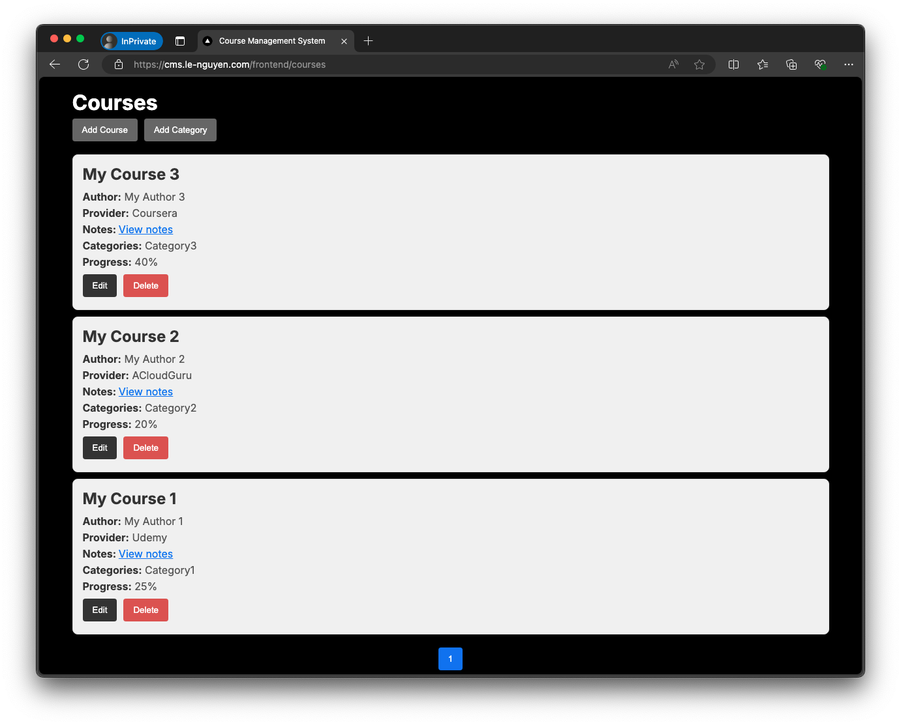
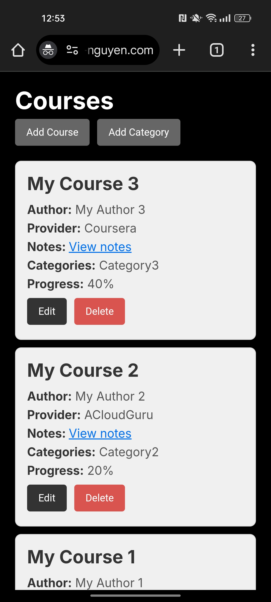

# Course Management System Project

<p align="center">
  
</p>

## Project description
This project is designed to track online learning progress, inspired by platforms like Udemy and Coursera. It allows users to:
- Store course details
- Record start and finish dates
- Save course-related notes

## How to run the project

1. Navigate to the [terraform](terraform) directory
2. Execute the following command:
```bash
terraform init && terraform apply --auto-approve
```
That's it! This single command initializes Terraform, sets up the underlying infrastructure, and deploys the entire application automatically.

## Features

### Automated Cluster Lifecycle Management with Terraform and Shell Scripts

- The shell scripts used in this project are designed to be **idempotent**, ensuring consistent results regardless of how many times they are executed.

The file [`main.tf`](terraform/main.tf) performs the following tasks:
- Creates a VPC with private and public subnets
- Deploys an Amazon EKS (Elastic Kubernetes Service) cluster with *min_size* of 1, *max_size* of 2 and *desired_size* of 1
- Executes the [`initialize_cluster.sh`](terraform/scripts/initialize_cluster.sh) script upon successful cluster creation
- Triggers the [`cleanup_cluster.sh`](terraform/scripts/cleanup_cluster.sh) script prior to cluster destruction when running *terraform destroy*

The script [`initialize_cluster.sh`](terraform/scripts/initialize_cluster.sh) performs the following tasks:
- Updates the kubeconfig to manage the cluster remotely
- Installs the AWS EBS CSI Driver using Helm
- Associates an IAM OIDC provider with the cluster
- Creates an IAM policy for the AWS Load Balancer Controller
- Creates an IAM service account for the AWS Load Balancer Controller
- Installs the AWS Load Balancer Controller using Helm
- Creates imagePullSecrets for ECR authentication
- Deploys the project (frontend, backend, and database) using Helm
- Waits for the Application Load Balancer to be created
- Updates Route 53 with a CNAME record pointing to the Load Balancer

The script [`cleanup_cluster.sh`](terraform/scripts/cleanup_cluster.sh) performs the following tasks:
- Updates the kubeconfig to manage the cluster remotely
- Deletes the Route 53 CNAME record pointing to the Load Balancer
- Removes the IAM policy for the AWS Load Balancer Controller
- Removes the IAM OIDC provider associated with the cluster
- Deletes the Application Load Balancer
- Removes the IAM service account for the AWS Load Balancer Controller

### Helm Chart Structure
```
.
├── Chart.yaml
├── templates
│   ├── backend
│   │   ├── deployment.yml
│   │   └── service.yml
│   ├── configmaps
│   │   └── mysql-initdb-config.yml
│   ├── database
│   │   ├── deployment.yml
│   │   └── service.yml
│   ├── frontend
│   │   ├── deployment.yml
│   │   └── service.yml
│   └── ingress.yml
└── values.yaml
```

Here we have three services: `frontend`, `backend` and `database`

### Automatic Route53 and ALB Setup with TLS-Enabled Custom Domain
This project uses shell scripts and Kubernetes ingress to automatically configure Route53 and set up an Application Load Balancer (ALB) with a custom domain. Here's the ingress configuration:
```yaml
ingress:
  enabled: true
  annotations:
    kubernetes.io/ingress.class: alb
    alb.ingress.kubernetes.io/scheme: internet-facing
    alb.ingress.kubernetes.io/target-type: ip
    alb.ingress.kubernetes.io/listen-ports: '[{"HTTP": 80}, {"HTTPS": 443}]'
    alb.ingress.kubernetes.io/certificate-arn: arn:aws:acm:eu-central-1:312290079196:certificate/e4f75d6f-c39b-421a-88fd-3765a434b641
    alb.ingress.kubernetes.io/ssl-redirect: '443'
  paths:
    - path: /frontend/*
      serviceName: frontend
      servicePort: 80
    - path: /backend/*
      serviceName: backend
      servicePort: 8080
```
Key features:
- The custom domain is pre-configured with a TLS certificate.
- All HTTP traffic is automatically redirected to HTTPS for enhanced security.
- The ALB is set up to handle both frontend and backend traffic, routing requests to appropriate services based on the URL path.

### MySQL Database schema

- MySQL database initialization script: [initialize_database.sql](backend/sql/initialize_database.sql)

### Automated Docker Build and Kubernetes Deployment via GitHub Actions
- If the Kubernetes cluster is not deployed, the workflow only builds the Docker image and pushes it to ECR, without attempting deployment.
- If the cluster is active, the workflow can proceed with updating the deployment.
- Workflow files:
    - [build-image-backend.yml](.github/workflows/build-image-backend.yml)
    - [build-image-frontend.yml](.github/workflows/build-image-frontend.yml)
    - [update-deployment-image.yml](.github/workflows/update-deployment-image.yml)

### Spring Boot MySQL integration
- Spring Data JPA and MySQL connector are used to integrate and utilize MySQL data source.
- Spring Boot backend code: [Click here](backend)

### Responsive React.js frontend
- React.js frontend code: [Click here](frontend)

<p align="center">
  <strong>Screenshot from PC</strong><br>
  <br><br>
  <strong>Vertical screenshot from phone</strong><br>
  
</p>
